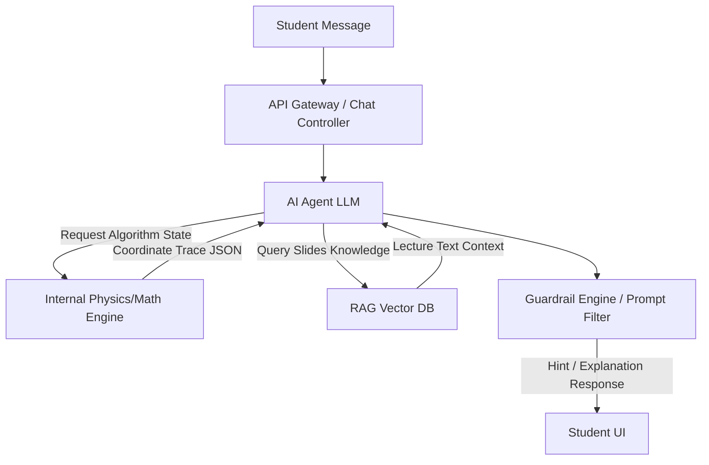

# Complexity Analysis: AI Tutor Agent for AAST Computer Graphics

Integrating an **AI Tutor Agent** into the AAST Computer Graphics Learning Portal presents a unique set of technical opportunities and implementation challenges. This document provides a formal analysis of the architecture, algorithmic complexity, integration methods, costs, and feasibility of deploying such an agent.

---

## 1. Core Objectives of the AI Agent

The AI Tutor is intended to serve as a 24/7 teaching assistant for Dr. Gouda Ismail's course. Its key capabilities would include:
1. **Syllabus and Concept Explanation**: Explaining complex terms (e.g., raster vs. random scan displays, geometric primitives, parametric continuity, 3D projections) based strictly on AAST slides.
2. **Algorithm Tracing & Walkthroughs**: Guiding students through DDA, Bresenham, Midpoint Circle, and Ellipse algorithm derivations.
3. **Step-by-Step Exercise Hinting**: Validating student trace values and providing conceptual hints (e.g., *"Look at your decision parameter. Since $P_k \geq 0$, did you update $y_{k+1}$ correctly?"*) rather than giving away complete solutions.

---

## 2. Technical Architecture & Complexity

To deliver a reliable AI assistant that does not hallucinate algorithm calculations, a hybrid architecture is required:

### A. Retrieval-Augmented Generation (RAG) for Syllabus Alignment
To ensure the AI explains topics exactly as taught by Dr. Gouda, we cannot rely solely on the general knowledge of LLMs.
*   **Vectorization**: Extract text, equations, and structures from the 10 course PDFs (`lec1.pdf` to `lec11.pdf`).
*   **Embedding Pipeline**: Convert document chunks into vectors (using models like Google's `text-embedding-004`) and store them in a local vector database (e.g., ChromaDB, FAISS) or a cloud-based service (Pinecone).
*   **Retrieval (Semantic Search)**: When a student asks, *"What is the difference between C1 and G1 continuity?"*, the backend queries the vector store, retrieves slides from **Week 08 - Spline Curves**, and prepends this context to the LLM prompt.

### B. Tool Calling (Function Calling) for Algorithm Safety
LLMs are notoriously weak at arithmetic and strict algorithmic loops, often making rounding mistakes on long lines or circles.
*   **Solution**: Equip the LLM with "tools" (JavaScript/Python functions) that execute the exact DDA, Bresenham, or Midpoint circle loops.
*   **Workflow**:
    1. Student asks: *"Show me the Bresenham trace for (2, 3) to (10, 8)."*
    2. LLM detects the intent and calls `run_bresenham_line({x1: 2, y1: 3, x2: 10, y2: 8})`.
    3. The portal's backend runs the code and returns the precise JSON trace array to the LLM.
    4. The LLM translates the JSON table into an easy-to-read, step-by-step tutorial.

### C. Guardrails & Pedagogical Prompting
A naive chatbot would immediately write the entire table for a student's graded homework.
*   **Pedagogical Guardrails**: The system prompt must force the AI into a "Socratic tutor" persona.
*   **Stateful Memory**: The agent tracks what step the student is on. If the student makes an error, the agent fetches the specific formula from its system context and asks a guiding question: *"Check your $P_k$ formula. For Midpoint Circle, if the previous $P_k < 0$, is the next parameter $P_k + 2x + 3$ or $P_k + 2x - 2y + 5$?"*

---

## 3. Feasibility and Complexity Matrix

| Aspect | Implementation Option A (Local Simulated Explainer) | Implementation Option B (Integrated LLM API - e.g., Gemini 1.5 Flash) | Implementation Option C (Autonomous Agentic System - LangChain/Autogen) |
| :--- | :--- | :--- | :--- |
| **Description** | Hardcoded, rule-based response router matching key phrases. | Cloud API calling a model with system instructions & function tools. | Full stateful agentic loop with custom tool-use and vector database search. |
| **Setup Overhead** | **Very Low**: pure client-side JS. | **Medium**: Requires backend API proxy, API keys, and server routes. | **High**: Requires python/node server, Vector DB indexing pipeline, orchestration. |
| **API Costs** | **$0** (Free, client-based) | **Micro-costs**: fractions of a cent per request (approx. $0.00015/query). | **Medium**: Multiple agent calls per query (approx. $0.002/query). |
| **Response Latency** | **Instant** (< 50ms) | **Low** (500ms - 1.5s with streaming) | **High** (3s - 8s due to multi-agent loops) |
| **Hallucination Risk**| **0%** (responses are pre-authored) | **Low** (managed via function calling and strict system prompt) | **Medium-Low** (agent can self-correct but has higher complexity) |
| **Adaptability** | **Poor** (only works for predefined questions) | **Excellent** (understands typos, Arabic/English slang, varied queries) | **Superior** (can adapt to custom grading schemes and files) |

---

## 4. Proposed Implementation Pathway for AAST

For the current deployment on **GitHub Pages**, we recommend starting with **Option A (Simulated AI Tutor)** directly in the frontend, combined with a blueprint for upgrading to **Option B**:

1.  **Phase 1 (Static MVP - Current)**: Embed an interactive chat interface that uses a local knowledge search (parsing the JSON files of lectures and exercises). It gives students instant, accurate answers about course structures, equations, and specific homework problems without requiring any cloud hosting.
2.  **Phase 2 (Cloud Integration - Optional)**: Dr. Gouda can host a small Node/Express server on a free tier platform (like Render or Vercel) and provide a `GEMINI_API_KEY`. The frontend chat component can switch its target URL to this proxy server to enable full natural language discussions and dynamic explanations.

---

## 5. Summary of API Hosting Cost Estimate (for Option B)
If upgrading to a live Gemini API model (using `gemini-1.5-flash`):
*   **Average request size**: 1,000 input tokens + 300 output tokens.
*   **Cost per query**: Input ($0.075 / 1M) + Output ($0.30 / 1M) = **$0.000165 per message**.
*   **Student Usage**: 100 students asking 50 questions each per semester = 5,000 queries.
*   **Total Semester Cost**: $0.000165 * 5000 = **$0.83 USD** for the entire class.
*   *Conclusion*: Integrating a live LLM API is extremely cheap and highly feasible financially for AAST.
