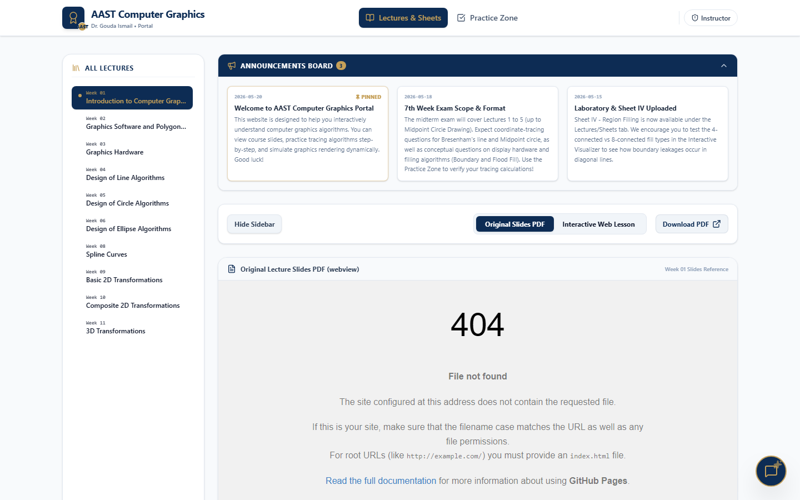
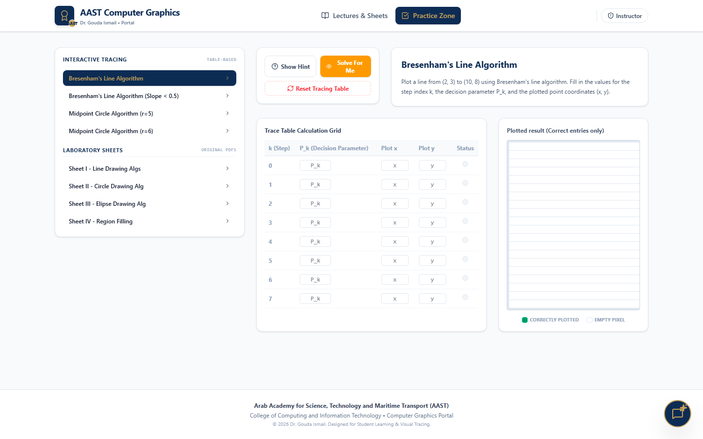
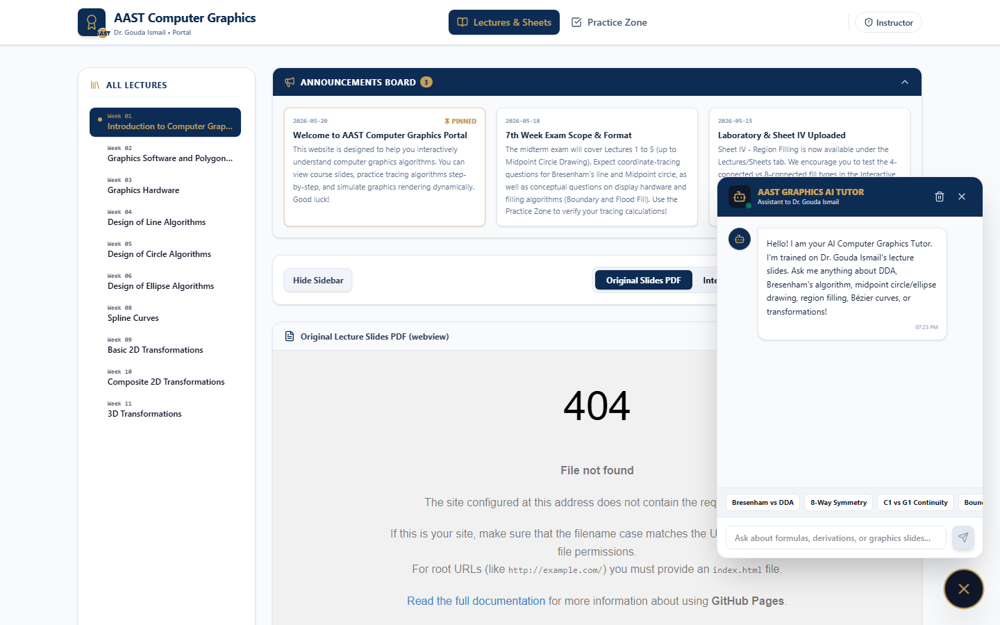

<div align="center">

# 📐 AAST Computer Graphics Portal

### Interactive Learning Portal for Dr. Gouda Ismail's Computer Graphics Course

*Built for the Arab Academy for Science, Technology & Maritime Transport (AAST)*

---

[](https://react.dev/)
[](https://www.typescriptlang.org/)
[](https://vitejs.dev/)
[](https://tailwindcss.com/)
[](https://ui.shadcn.com/)
[](https://4awmy.github.io/computer-graphics-portal/)
[](https://4awmy.github.io/computer-graphics-portal/)

</div>

---

## 📖 About

The **AAST Computer Graphics Portal** is a full-featured, interactive web application designed to support students throughout Dr. Gouda Ismail's Computer Graphics course. It combines structured lecture content with hands-on algorithm visualizers, an adaptive practice zone, and a floating AI tutor — all in a single, unified interface.

The portal features a **password-protected Instructor Dashboard** that allows the course instructor to edit announcements, lecture content, and exercises directly from the UI in local development, with changes pushed to GitHub via a built-in Git sync workflow.

> 🌐 **Live Site:** [https://4awmy.github.io/computer-graphics-portal/](https://4awmy.github.io/computer-graphics-portal/)

---

## 📸 Screenshots

<div align="center">

| Lectures & Sheets | Practice Zone |
|:-----------------:|:-------------:|
|  |  |

| AI Tutor |
|:--------:|
|  |

</div>

---

## ✨ Features

### 📚 Lectures & Sheets

| Feature | Description |
|---------|-------------|
| **Weekly Slides** | Browse Weeks 1–11 lecture slides with inline PDF viewer |
| **Practice Sheets** | Access Sheets I–IV with concise summaries and formula tables |
| **Announcements** | Course-wide announcements pinned at the top of the view |
| **Quick Navigation** | Jump directly from a lecture to its associated practice exercise |

---

### 🖥️ Algorithm Visualizers

| Algorithm | Description |
|-----------|-------------|
| **DDA Line Drawing** | Step-through Digital Differential Analyzer rasterization |
| **Bresenham's Line** | Integer-only Bresenham line algorithm with decision variable trace |
| **Midpoint Circle** | Midpoint algorithm for circle rasterization |
| **Midpoint Ellipse** | Two-region midpoint ellipse algorithm |
| **Boundary Fill** | Recursive boundary-fill with live recursion stack trace |
| **Flood Fill** | 4-connected flood fill with live recursion stack trace |

---

### 🧩 Practice Zone

| Feature | Description |
|---------|-------------|
| **Trace Table Exercises** | Step-through exercises where students fill in algorithm trace tables |
| **Cell-by-Cell Validation** | Socratic feedback that validates each cell individually |
| **Adaptive Hints** | Progressive hints that guide without giving away the answer |
| **Exercise Navigation** | Browse the full exercise library or jump directly from a lecture |

---

### 🤖 AI Tutor

| Feature | Description |
|---------|-------------|
| **Floating Chat Interface** | Always-accessible AI tutor widget that doesn't interrupt navigation |
| **Concept Explanations** | Explains rasterization, scan conversion, and filling concepts |
| **Problem Guidance** | Walks through algorithm steps without solving directly |

---

### 🛡️ Instructor Dashboard

| Feature | Description |
|---------|-------------|
| **Announcement Editor** | Add, edit, and remove course announcements |
| **Lecture Outline Editor** | Update lecture titles, summaries, and linked resources |
| **Exercise Editor** | Create and modify practice zone exercises and answer keys |
| **Save to Disk** | Writes changes directly to `src/data/` JSON files (dev mode only) |
| **Git Sync** | Commits and pushes changes to GitHub with a custom commit message |

> **Note:** Save to Disk and Git Sync use Vite dev-server middleware and are only available in local development. On the deployed GitHub Pages site, all edits persist in the browser's `localStorage`.

---

## 🏗️ Architecture

```
┌──────────────────────────────────────────────────────────┐
│                      React SPA (Vite)                    │
│                                                          │
│  ┌─────────────────┐   ┌──────────────┐                 │
│  │  LecturesView   │   │  PracticeZone│                 │
│  │  (Slides, PDFs) │   │  (Exercises) │                 │
│  └─────────────────┘   └──────────────┘                 │
│                                                          │
│  ┌─────────────────┐   ┌──────────────────────────────┐ │
│  │  Demos          │   │  InstructorDashboard          │ │
│  │  (Visualizers)  │   │  (Password-protected editor)  │ │
│  └─────────────────┘   └──────────────────────────────┘ │
│                                                          │
│  ┌──────────────────────────────────────────────────┐   │
│  │  AITutorSim — Floating global chatbot widget     │   │
│  └──────────────────────────────────────────────────┘   │
│                                                          │
│  State: React useState + localStorage persistence        │
└──────────────────────────────────────────────────────────┘
                          │
          ┌───────────────▼───────────────┐
          │  src/data/ (JSON)             │
          │  lectures.json                │
          │  exercises.json               │
          │  announcements.json           │
          └───────────────────────────────┘
                          │
          ┌───────────────▼───────────────┐
          │  Vite Dev Middleware (local)   │
          │  /api/save  → writes JSON     │
          │  /api/git-sync → git push     │
          └───────────────────────────────┘
```

---

## 🛠️ Tech Stack

| Layer | Technology | Purpose |
|-------|-----------|---------|
| **Framework** | React 18 | Component-based UI |
| **Language** | TypeScript 5 | Type-safe development |
| **Build Tool** | Vite | Fast dev server + production build |
| **Styling** | Tailwind CSS 3 | Utility-first CSS |
| **UI Components** | shadcn/ui | Accessible, composable primitives |
| **Icons** | Lucide React | Consistent icon set |
| **Data** | JSON files | Static content database |
| **Persistence** | localStorage | Client-side state between sessions |
| **Deployment** | GitHub Actions + GitHub Pages | Automated CI/CD |

---

## 🚀 Quick Start

### Prerequisites

- Node.js 18+
- npm or yarn

### 1. Clone the Repository

```bash
git clone https://github.com/4awmy/computer-graphics-portal.git
cd computer-graphics-portal/portal
```

### 2. Install Dependencies

```bash
npm install
```

### 3. Start the Development Server

```bash
npm run dev
```

Open [http://localhost:5173](http://localhost:5173) in your browser.

### 4. Production Build

```bash
npm run build
```

Output goes to `dist/` — ready to serve as a static site.

---

## 🌐 Deployment (GitHub Pages)

The repo includes a GitHub Actions workflow at `.github/workflows/deploy.yml` that automatically builds and publishes the site on every push to `main`.

### One-time setup

1. Go to **Settings → Pages** in your GitHub repository.
2. Under **Build and deployment**, select **GitHub Actions**.
3. Click **Save** — the workflow will deploy automatically.

---

## 📁 Project Structure

```
portal/
│
├── public/                      # Static assets (favicon, icons)
│
├── src/
│   ├── components/
│   │   ├── Navigation.tsx        # Top navigation bar
│   │   ├── LecturesView.tsx      # Lectures & Sheets tab
│   │   ├── PracticeZone.tsx      # Practice exercises tab
│   │   ├── Demos.tsx             # Algorithm visualizers
│   │   ├── AITutorSim.tsx        # Floating AI tutor widget
│   │   └── InstructorDashboard.tsx  # Password-protected editor
│   │
│   └── data/
│       ├── lectures.json         # Lecture content & metadata
│       ├── exercises.json        # Practice zone exercises
│       └── announcements.json   # Course announcements
│
├── docs/
│   └── screenshots/             # Portal screenshots
│
├── .github/
│   └── workflows/
│       └── deploy.yml            # GitHub Pages CI/CD pipeline
│
├── vite.config.ts                # Vite config + dev-server API middleware
├── tailwind.config.ts
└── package.json
```

---

## 👥 Authors & Credits

<div align="center">

| Name | Role |
|------|------|
| **Omar Hossam** | Developer — Architecture, UI, Visualizers |

*Built for:*

**🏛️ Arab Academy for Science, Technology & Maritime Transport (AAST)**
**College of Computing and Information Technology**
**Dr. Gouda Ismail — Computer Graphics**

</div>

---

## 🔗 Links

| Resource | URL |
|----------|-----|
| 🌐 Live Portal | [4awmy.github.io/computer-graphics-portal](https://4awmy.github.io/computer-graphics-portal/) |
| 📦 GitHub Repository | [github.com/4awmy/computer-graphics-portal](https://github.com/4awmy/computer-graphics-portal) |

---

## 📄 License

MIT License — see `LICENSE` for details.

---

<div align="center">

*Built with ❤️ at AAST · Powered by React, TypeScript, Vite & Tailwind CSS*

</div>
